# Fanatic

Fanatic is a professional animation template showcasing intricate animations and modern design elements. This project aims to recreate its essence using React.js.

## Demo

## [](https://fanatic.onrender.com/)

## Technologies Used

- : Frontend development framework for building user interfaces.
- : State management tool for predictable state containers in React applications.
- : Icon library for React applications.
- : Library for animations triggered when elements come into view during scrolling.
- : Component for animating vertical scrolling with easing effects.
- : Component for adding a scroll to top button functionality.
- : Component for creating typewriter-like text animations.
- : Modern touch slider library for React.

## Installation

1. **Clone the repository:**

   ```bash
   git clone https://github.com/your-username/foodpanda-clone.git
   cd foodpanda-clone
   ```

2. **Install dependencies:**

   ```bash
   npm install
   ```

3. **Start the development server:**

   ```bash
   npm start
   ```

**Project Images**

<div class="d-flex">

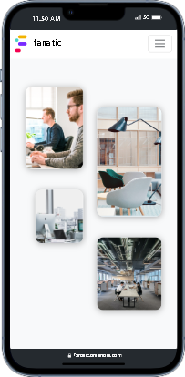
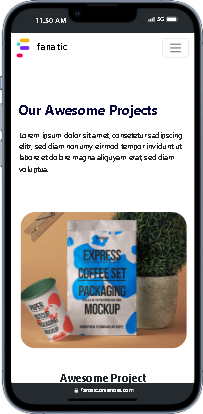
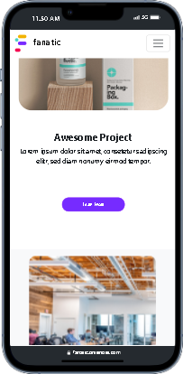
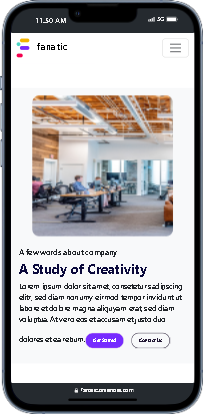
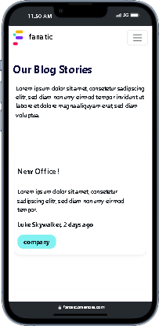
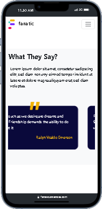
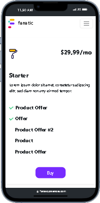
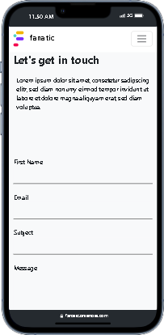
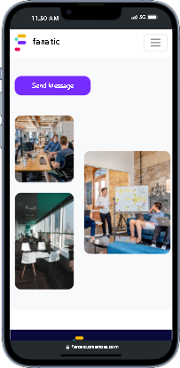
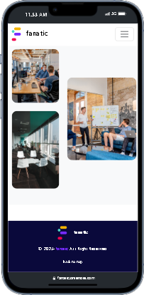
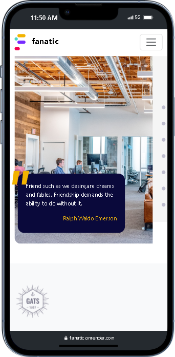
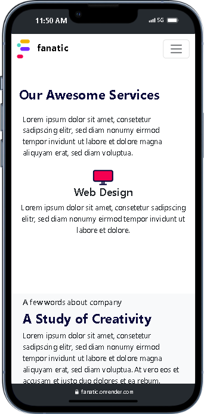
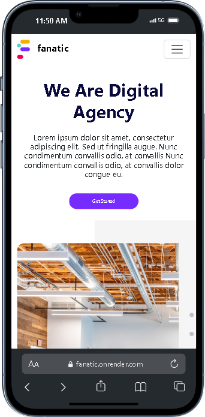
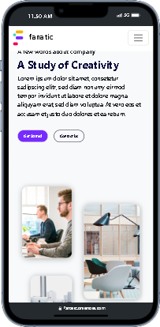


</div>

## Contributing

Contributions are welcome! If you'd like to contribute to this project, feel free to open an issue or submit a pull request.

## License

This project is licensed under the [MIT License](LICENSE).

---

## Feel free to customize the content according to your specific project details and requirements.
